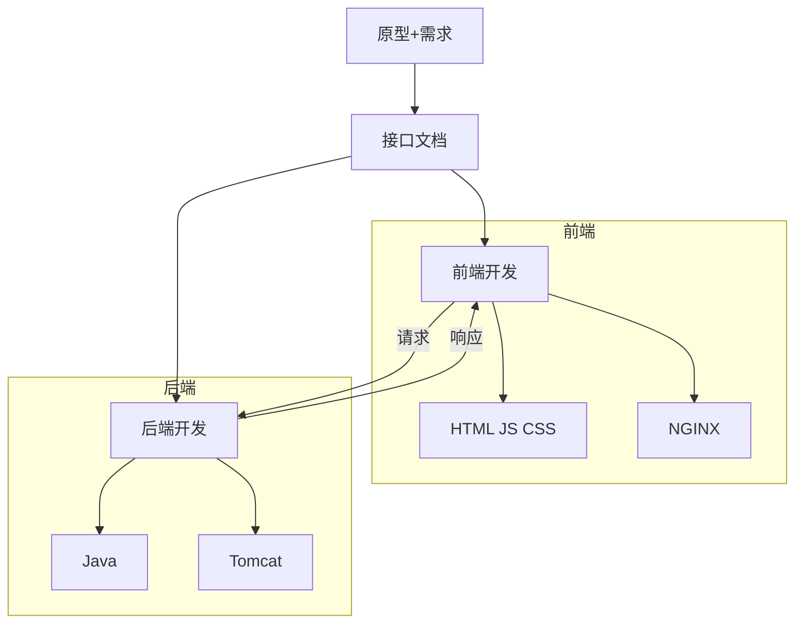

## 开发规范



前端人员和后端人员根据接口文档开发，接口文档通常由后端人员负责编写
## RESTful
REST（Representational State Transfer），表述性状态转换，它是一种软件架构风格

```http
REST风格
http://localhost:8080/users/1 GET：查询id为1的用户
http://localhost:8080/users POST：新增用户         
http://localhost:8080/users PUT：修改用户
http://localhost:8080/users/1 DELETE：删除id为1的用户       
```

### 注意事项
- REST是风格，是约定方式，约定不是规定，可以打破。
- 描述模块的功能通常使用复数，也就是加s的格式来描述，表示此类资源，而非单个资源。如：users、emps、books...

## 统一响应结果
在SpringBoot项目中，通常会创建一个统一的响应结果类（如`Result`类），以标准化API接口的返回格式。通过定义`code`, `msg`, 和 `data`三个字段，可以使不同接口的返回数据保持一致。典型的`Result`类如下：

```java
public class Result {
    private Integer code;   // 状态码
    private String msg;     // 返回信息
    private Object data;    // 返回数据

    // 构造函数
    public Result() {}

    public Result(Integer code, String msg, Object data) {
        this.code = code;
        this.msg = msg;
        this.data = data;
    }

    // 静态方法: 成功时返回
    public static Result success(Object data) {
        return new Result(200, "成功", data);
    }

    // 静态方法: 出错时返回
    public static Result error(String msg) {
        return new Result(500, msg, null);
    }

    // Getter 和 Setter 方法
    public Integer getCode() {
        return code;
    }

    public void setCode(Integer code) {
        this.code = code;
    }

    public String getMsg() {
        return msg;
    }

    public void setMsg(String msg) {
        this.msg = msg;
    }

    public Object getData() {
        return data;
    }

    public void setData(Object data) {
        this.data = data;
    }
}
```

在控制器中，可以像这样使用`Result`类统一响应数据：

```java
@RestController
public class ExampleController {

    @GetMapping("/example")
    public Result example() {
        // 处理逻辑...
        return Result.success("这是成功的响应数据");
    }

    @GetMapping("/errorExample")
    public Result errorExample() {
        // 处理错误逻辑...
        return Result.error("这是错误的响应消息");
    }
}
```

## 开发流程
查看页面原型
明确需求
阅读接口文档
思路分析
接口开发
接口测试 Postman测试
前后端联调


## 日志记录
```
@Slf4j

private static Logger log = LoggerFactory.getLogger(DeptContrlloer.class);
log.info("查询全部部门数据");
```