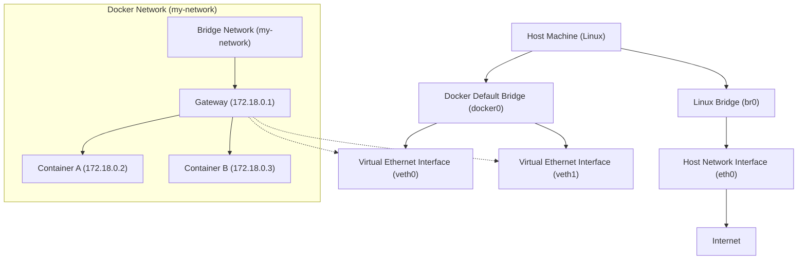

Docker 是一种开源的容器化平台，能够在开发和生产环境中轻松部署和管理应用程序。Docker 容器具有轻量、便携、自包含的特点，允许你在任何环境下运行相同的应用程序和依赖项。

## Docker 基础概念
1. **镜像（Image）**：镜像是一个只读的模板，包含应用程序运行所需的环境和代码。可以把它看作应用程序的快照。
2. **容器（Container）**：容器是镜像的实例，是一个独立的运行环境。容器之间是隔离的，可以轻松启动、停止或删除。
3. **Dockerfile**：定义镜像的构建过程和依赖项的文件。
4. **仓库（Repository）**：存储和分发镜像的地方。Docker Hub 是最常用的公有仓库。

## 常用 Docker 命令
1. **安装 Docker**
   - 在不同系统下，Docker 的安装方式有所不同。可以参考 [Docker 官方文档](https://docs.docker.com/) 获取详细的安装步骤。

2. **镜像相关命令**
   - `docker pull <image>`：从 Docker Hub 或其他镜像仓库下载镜像。
     - 例如：`docker pull nginx`
   - `docker images`：列出本地的所有镜像。
   - `docker rmi <image>`：删除本地镜像。
     - 例如：`docker rmi nginx`

3. **容器相关命令**
   - `docker run <image>`：使用镜像创建并启动一个新的容器。
     - 例如：`docker run nginx` 会拉取 Nginx 镜像并启动一个 Nginx 容器。
   - `docker ps`：查看正在运行的容器。
   - `docker ps -a`：查看所有容器，包括停止的容器。
   - `docker stop <container>`：停止一个正在运行的容器。
     - 例如：`docker stop <container_id>`
   - `docker start <container>`：重新启动已停止的容器。
   - `docker rm <container>`：删除一个停止的容器。
     - 例如：`docker rm <container_id>`

4. **构建镜像**
   - `docker build -t <image_name> .`：基于当前目录的 Dockerfile 构建一个镜像，并命名为 `<image_name>`。
     - 例如：`docker build -t myapp .`

5. **容器交互**
   - `docker exec -it <container> /bin/bash`：进入容器的终端，进行交互式操作。
     - 例如：`docker exec -it myapp_container /bin/bash`

6. **查看容器日志**
   - `docker logs <container>`：查看指定容器的日志。

7. **网络管理**
   - `docker network ls`：查看所有 Docker 网络。
   - `docker network create <network_name>`：创建一个新的网络。
   - `docker network connect <network_name> <container>`：将容器连接到指定网络。

8. **数据卷（Volumes）**
   - `docker volume ls`：列出所有 Docker 数据卷。
   - `docker volume create <volume_name>`：创建新的数据卷。
   - `docker run -v <volume_name>:/path/in/container <image>`：将主机的目录挂载到容器的某个路径。

这些是 Docker 中最常用的命令。学习 Docker 后，能够更轻松地管理应用程序的开发和部署环境。

有什么特定问题或想更深入了解的命令吗？


## 数据卷挂载和本地挂载
数据卷是干什么的：数据卷的存在是为了简化使用对镜像中文件的修改

在执行docker run命令时，使用-v 数据卷：容器内目录可以完成数据卷挂载
当创建容器时，如果挂载了数据卷且数据卷不存在，会自动创建数据卷

那已经创建的容器如何挂载数据卷呢

在执行docker run命令时，使用-v本地目录：容器内目录可以完成本地目录挂载
本地目录必须以“”或"/"开头，如果直接以名称开头，会被识别为数据卷而非本地目录
·-v mysql:Nar/Iib/mysql会被识别为一个数据卷叫mysql
,-v./mysql:var/Iib/mysql会被识别为当前目录下的mysqlE目录


镜像，镜像所产生的数据，是否独立
是的，需要通过本地目录挂载进行配置

## Dockerfile语法创建镜像
镜像的结构是怎样的？
镜像中包含了应用程序所需要的运行环境、函数库、配置、以及应用
本身等各种文件，这些文件分层打包而成。
Dockerfile是做什么的？
Dockerfile.就是利用固定的指令来描述镜像的结构和构建过程，这样
Docker才可以依次来构建镜像
构建镜像的命令是什么？
docker build-t镜像名Dockerfile目录


| 指令         | 说明                           | 示例                                   |
|--------------|--------------------------------|----------------------------------------|
| FROM         | 指定基础镜像                   | FROM centos:6                          |
| ENV          | 设置环境变量，可在后面指令中使用 | ENV key value                          |
| COPY         | 拷贝本地文件到镜像的指定目录   | COPY ./jre11.tar.gz /tmp               |
| RUN          | 执行Linux的shell命令，一般是安装过程的命令 | RUN tar -zxvf /tmp/jre11.tar.gz && EXPORTS path=/tmp/jre11:$path |
| EXPOSE       | 指定容器运行时监听的端口，是给镜像使用者看的 | EXPOSE 8080                            |
| ENTRYPOINT   | 镜像中应用的启动命令，容器运行时调用 | ENTRYPOINT java -jar xx.jar            |

## 自定义网络


在 Docker 中，网络是容器之间、容器与宿主机之间、甚至容器与外部网络之间进行通信的核心。`docker network create` 命令用于创建一个新的 Docker 网络，通常基于 Linux 系统中的网桥（bridge）。

### Docker 网络创建原理

当你执行 `docker network create` 命令时，Docker 会在 Linux 宿主机上创建一个虚拟的网桥接口，并为该网络分配一个子网和网关。容器连接到这个网络后，都会通过这个网桥进行通信。

1. Docker 使用 Linux 的网桥技术创建虚拟网络，容器之间可以通过该网桥进行互相通信。
2. 宿主机和容器之间通过 NAT（网络地址转换）进行数据交换，容器内部的 IP 地址对外部不可见，外部只能通过端口映射访问容器服务。
3. Docker 提供了不同类型的网络驱动，如：
   - `bridge`：默认的网络驱动，容器通过该网络进行通信。
   - `host`：容器使用宿主机的网络栈。
   - `overlay`：用于跨多宿主机的 Docker Swarm 集群通信。

### Docker Network 创建流程的 Mermaid 图

我们可以通过 Mermaid 图展示 `docker network create` 之后的网络结构，包括 Docker 容器、虚拟网桥、宿主机网络的关系。



### 图的说明：

1. **宿主机的 Linux 桥接网络**：
   - `docker0` 是 Docker 在宿主机上创建的默认桥接网络，所有不指定网络的容器会自动连接到 `docker0`。
   - `br0` 是 Linux 系统的物理网桥，连接到宿主机的物理网卡 `eth0`，负责宿主机与外部网络（例如互联网）之间的通信。

2. **虚拟网桥与 Docker 网络**：
   - 当执行 `docker network create my-network` 命令后，Docker 会创建一个新的桥接网络（如 `my-network`），它是一个虚拟网桥，和宿主机的网络隔离。
   - 网桥会创建一个虚拟的网关（如 `172.18.0.1`），通过这个网关，所有连接到该网络的容器（如 `Container A` 和 `Container B`）可以通过虚拟网桥互相通信。

3. **虚拟以太网对（veth pairs）**：
   - 每个容器的网络接口（如 `veth0` 和 `veth1`）会连接到网桥，从而容器能够与其他容器和宿主机通信。
   - 宿主机与容器之间的通信通过 NAT 来进行，宿主机通过虚拟网桥来管理容器的流量。

4. **外部网络连接**：
   - 宿主机通过物理网卡 `eth0` 连接到外部网络（如互联网）。Docker 容器可以通过宿主机的网络接口与外部网络通信，前提是需要端口映射或特定的网络配置（例如 `--network host` 模式）。

### 总结：
1. **创建网桥**：执行 `docker network create` 时，Docker 会在 Linux 宿主机上创建一个新的虚拟网桥，并为容器配置独立的子网。
2. **虚拟网卡连接**：每个容器都通过虚拟以太网对（veth pairs）与 Docker 的网桥相连，容器可以通过虚拟网桥与其他容器通信。
3. **网关与子网**：Docker 为新建的网络自动分配一个网关和子网，容器通过网关与宿主机和外部网络进行通信。

通过 Docker 网络，我们可以轻松地管理容器之间的通信，使用桥接网络则能提供容器间的隔离和独立的子网结构。

| 命令                          | 说明                    | 文档地址                          |
|-------------------------------|-------------------------|-----------------------------------|
| docker network create          | 创建一个网络            | [docker network create](#)        |
| docker network ls              | 查看所有网络            | [docker network ls](#)            |
| docker network rm              | 删除指定网络            | [docker network rm](#)            |
| docker network prune           | 清除未使用的网络        | [docker network prune](#)         |
| docker network connect         | 使指定容器连接加入某网络 | [docker network connect](#)       |
| docker network disconnect      | 使指定容器连接离开某网络 | [docker network disconnect](#)    |
| docker network inspect         | 查看网络详细信息        | [docker network inspect](#)       |


## DockerCompose
### 介绍
Docker Compose通过一个单独的docker-compose.yml模板文件(YAML格式)来定义一组相关联的应用容器，帮助我们实现多个相互关联的Docker容器的快速部署。Docker Compose通过一个单独的docker-compose.yml模板文件(YAML格式)来定义一组相关联的应用容器，帮助我们实现多个相互关联的Docker容器的快速部署。


### 模板
下面我为你展示一个 `docker-compose.yml` 模板以及与之相对应的 `docker run` 命令模板，并对二者的区别进行说明。

#### 1. Docker Compose 模板 (`docker-compose.yml`)

```yaml
version: '3'
services:
  web:
    image: nginx:latest
    ports:
      - "8080:80"
    volumes:
      - ./html:/usr/share/nginx/html
    networks:
      - my-network
    depends_on:
      - app

  app:
    image: node:14
    environment:
      - NODE_ENV=production
    volumes:
      - ./app:/usr/src/app
    command: "npm start"
    networks:
      - my-network

networks:
  my-network:
    driver: bridge
```

#### 2. Docker Run 命令模板

```bash
# 启动 web 容器
docker run -d --name web \
  -p 8080:80 \
  -v $(pwd)/html:/usr/share/nginx/html \
  --network=my-network \
  nginx:latest

# 启动 app 容器
docker run -d --name app \
  -e NODE_ENV=production \
  -v $(pwd)/app:/usr/src/app \
  --network=my-network \
  node:14 npm start
```

---

#### 对比和解释

##### 1. **Compose 的优势**
   - **更简洁易读**：Compose 模板使用 YAML 格式，可以非常直观地定义多个服务、网络和卷的配置，便于维护和共享。
   - **依赖管理**：在 `docker-compose.yml` 中可以使用 `depends_on` 来明确容器的启动顺序。例如，`web` 服务依赖于 `app` 服务，它会确保在 `app` 启动完成后再启动 `web` 服务。
   - **自动网络创建**：Compose 文件可以直接在 `networks` 部分定义网络，Docker 会自动创建和管理网络，而在 `docker run` 中，需要手动创建网络。
   - **环境变量和卷配置**：Compose 可以通过 `environment` 字段非常清晰地管理环境变量，而 `docker run` 则需要通过 `-e` 选项逐个定义。卷也可以通过 `volumes` 简单管理。
   - **跨平台兼容**：Compose 文件更易于在不同环境中共享，适合在开发、测试、生产等不同环境下保持一致的配置。

##### 2. **Docker Run 的特点**
   - **灵活性高**：`docker run` 命令可以通过命令行快速启动容器，但不适合管理复杂的多容器应用。
   - **较为冗长**：相对于 Compose，`docker run` 启动容器时需要输入较多的参数，管理多个容器时会显得复杂。

---

##### 3. **Docker Compose 中的额外功能**
   - **`depends_on`**：这个指令在 `docker-compose.yml` 中用于表示服务之间的依赖关系，例如 `web` 容器需要等待 `app` 容器先启动。这是 `docker run` 所没有的功能。如果使用 `docker run`，需要手动管理启动顺序。
   - **`networks`**：Compose 模板可以直接在文件的最外层定义并创建自定义的 Docker 网络，而不需要像 `docker run` 那样手动创建网络。Docker Compose 会自动管理网络的创建和清理。
   - **`volumes`**：Compose 可以在文件中集中管理数据卷，保证服务的状态可以持久化，方便多个容器共享数据。

##### 4. **总结**
   - 使用 `docker-compose.yml` 模板更适合管理复杂的、多容器的应用，因为它不仅可以定义多个容器，还能管理网络、卷和环境变量等。
   - `docker run` 更适合于快速地启动单个容器或进行一些临时性的操作，而当项目逐渐复杂时，Compose 的优势会更为明显。

希望这个对比能帮助你更好地理解 Docker Compose 和 `docker run` 的区别以及如何使用它们！

### 命令

```bash
docker compose [options] [command]
```

| 类型      | 参数或指令 | 说明                                       |
|-----------|------------|--------------------------------------------|
| Options   | -f         | 指定compose文件的路径和名称                 |
|           | -p         | 指定project名称                            |
| Commands  | up         | 创建并启动所有service容器                   |
|           | down       | 停止并移除所有容器、网络                    |
|           | ps         | 列出所有启动的容器                          |
|           | logs       | 查看指定容器的日志                          |
|           | stop       | 停止容器                                   |
|           | start      | 启动容器                                   |
|           | restart    | 重启容器                                   |
|           | top        | 查看运行的进程                              |
|           | exec       | 在指定的运行中容器中执行命令                |


f9xuWuQwOmpB7JSwbWVV3Tmx3wmM7nJlwFX5yDaL
Nx_jeqvLvAV_Ehhc8TMxtk-rhwhm_NQ3U3KyNxoQ